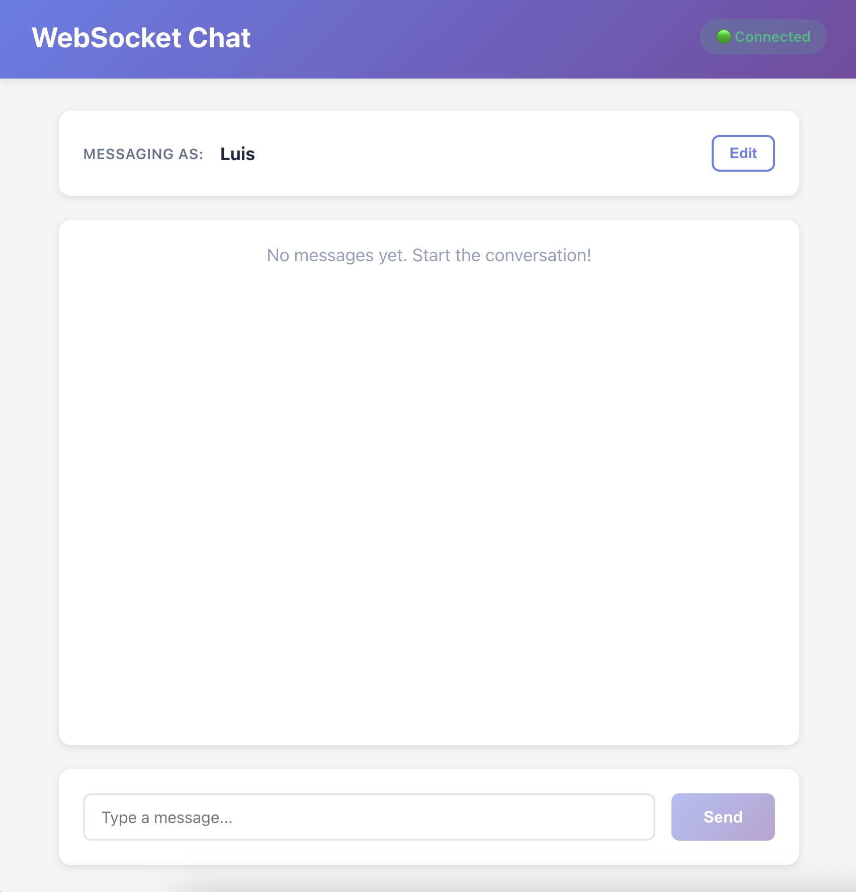

# WebSocket Template

A production-ready WebSocket template with **Fastify** (backend) + **Vite + React + TypeScript** (frontend).
wow


**Live Demo (Render):** https://websocket-sample-1.onrender.com

This template provides a clean separation between **reusable WebSocket plumbing** and **pluggable application logic**, making it easy to build real-time apps like chat applications, multiplayer games, collaborative tools, and more.

## 🚀 Quick Start

### Prerequisites

- **Node.js** >= 18.0.0
- **npm** (comes with Node.js)

### Installation

```bash
# Clone the repository
git clone <your-repo-url>
cd websocket-template

# Install all dependencies (root + server + client)
npm install
```

### Development

You need **two terminals** - one for the server, one for the client:

**Terminal 1 - Server:**
```bash
npm run dev:server
```
Server runs on `http://0.0.0.0:3000`

**Terminal 2 - Client:**
```bash
npm run dev:client
```
Client dev server runs on `http://0.0.0.0:5173` (reachable on LAN)

### Access

- **Localhost (laptop):** Open `http://localhost:5173`
- **LAN (phone/tablet on same Wi‑Fi):** Open `http://<your-laptop-ip>:5173`
  - Find your IP with `ifconfig` (Mac/Linux) or `ipconfig` (Windows)
  - Look for `192.168.x.x` or `10.x.x.x`

### Production Build

```bash
# Build both server and client
npm run build

# Start production server (serves built client + WebSocket)
npm start
```

Production server runs on `http://0.0.0.0:3000` and serves the client build.

## 📁 Project Structure

```
websocket-template/
├── server/                         # Fastify + TypeScript backend
│   ├── src/
│   │   ├── index.ts               # 🔧 Server bootstrap (reusable)
│   │   ├── wsServer.ts            # 🔧 WebSocket plumbing (reusable)
│   │   ├── appLogic.ts            # 🎮 Demo chat app (REPLACE THIS)
│   │   └── types.ts               # 📦 Message protocol types
│   └── package.json
│
├── client/                         # Vite + React + TypeScript
│   ├── src/
│   │   ├── wsClient.ts            # 🔧 WebSocket client wrapper (reusable)
│   │   ├── App.tsx                # 🎮 Demo chat UI (REPLACE THIS)
│   │   ├── types.ts               # 📦 Message protocol types
│   │   └── main.tsx               # React entry point
│   └── package.json
│
├── package.json                    # Root workspace config
└── README.md
```

**Legend:**
- 🔧 **Reusable plumbing** - Keep these files for any app
- 🎮 **Pluggable logic** - Replace these files with your app-specific code
- 📦 **Shared types** - Update these to match your message protocol

## 🎮 Customizing for Your App

The template is designed so you only need to modify a small, well-defined part to create different apps.

### Step 1: Define Your Message Types

**Edit both `server/src/types.ts` and `client/src/types.ts`:**

```typescript
// Example: Tic-Tac-Toe game messages
export type ClientMessage =
  | { type: 'joinGame'; payload: { playerName: string } }
  | { type: 'makeMove'; payload: { position: number } };

export type ServerMessage =
  | { type: 'gameState'; payload: GameState }
  | { type: 'playerJoined'; payload: { playerName: string } }
  | { type: 'moveMade'; payload: { player: number; position: number } };
```

### Step 2: Implement Server Logic

**Edit `server/src/appLogic.ts`:**

```typescript
interface GameState {
  board: number[];
  currentPlayer: number;
  players: Map<string, Player>;
}

export const gameLogic: AppLogic<GameState> = {
  createInitialState: () => ({
    board: Array(9).fill(0),
    currentPlayer: 1,
    players: new Map(),
  }),

  handleConnect: (state, clientId, helpers) => {
    // Initialize player
  },

  handleMessage: (state, { clientId, message, helpers }) => {
    switch (message.type) {
      case 'makeMove':
        // Handle game move
        break;
    }
  },

  handleDisconnect: (state, clientId, helpers) => {
    // Clean up player
  },
};
```

### Step 3: Build Your UI

**Edit `client/src/App.tsx`:**

Replace the chat UI with your game/app interface. Use the `WSClient` to send and receive messages:

```typescript
import { WSClient } from './wsClient';

const wsClient = new WSClient();

// Send messages
wsClient.send({
  type: 'makeMove',
  payload: { position: 4 }
});

// Receive messages
wsClient.on('message', (message) => {
  if (message.type === 'gameState') {
    // Update UI with game state
  }
});
```

## 🏗️ Architecture

### Server (Fastify + TypeScript)

**`server/src/wsServer.ts`** - Reusable WebSocket plumbing:
- Manages WebSocket connections
- Assigns unique `clientId` to each connection
- Routes messages to app logic
- Provides helper functions:
  - `broadcastAll(message)` - Send to everyone
  - `sendTo(clientId, message)` - Send to specific client
  - `broadcastExcept(clientId, message)` - Send to all except one

**`server/src/appLogic.ts`** - Pluggable app logic:
- Manages application state
- Handles connect/disconnect/message events
- **This is where your game/app logic goes**

**`server/src/index.ts`** - Fastify server:
- HTTP server setup
- Static file serving (production)
- WebSocket server initialization
- Graceful shutdown

### Client (Vite + React + TypeScript)

**`client/src/wsClient.ts`** - Reusable WebSocket client:
- Connects to WebSocket server
- Auto-detects `ws://` vs `wss://` based on page protocol
- Automatic reconnection with exponential backoff
- Type-safe message sending/receiving
- Event-based API (`on('message')`, `on('open')`, etc.)

**`client/src/App.tsx`** - Demo UI:
- React component using the WebSocket client
- **This is where your UI goes**

## 🔌 WebSocket Client API

```typescript
const wsClient = new WSClient({
  url: 'ws://localhost:3000',           // Optional: defaults to current host
  initialReconnectDelay: 3000,          // Optional: default 3s
  maxReconnectDelay: 30000,             // Optional: default 30s
  maxReconnectAttempts: Infinity,       // Optional: unlimited
});

// Connect
wsClient.connect();

// Send messages (type-safe)
wsClient.send({ type: 'myMessage', payload: { ... } });

// Listen for events
wsClient.on('open', () => console.log('Connected!'));
wsClient.on('close', () => console.log('Disconnected'));
wsClient.on('message', (message) => console.log('Received:', message));
wsClient.on('error', (error) => console.error('Error:', error));

// Check connection status
if (wsClient.isConnected()) {
  // Do something
}

// Disconnect
wsClient.disconnect();
```

## 🛠️ Available Scripts

### Root (Workspace)
```bash
npm install              # Install all dependencies
npm run dev:server       # Start server in dev mode
npm run dev:client       # Start client in dev mode
npm run build            # Build both server and client
npm start                # Run production server
npm run typecheck        # Type-check both packages
```

### Server
```bash
cd server
npm run dev              # Dev mode with hot reload (tsx)
npm run build            # Compile TypeScript to dist/
npm start                # Run compiled code
npm run typecheck        # Type-check without emitting
```

### Client
```bash
cd client
npm run dev              # Vite dev server bound to 0.0.0.0:5173 (LAN-ready)
npm run build            # Build for production
npm run preview          # Preview production build
npm run typecheck        # Type-check without emitting
```

## 🌍 LAN Access

The server binds to `0.0.0.0:3000` by default, making it accessible from other devices on your network.

**To access from your phone:**

1. Find your laptop's IP address:
   - **Mac/Linux:** `ifconfig | grep "inet "`
   - **Windows:** `ipconfig`
   - Look for IP like `192.168.x.x` or `10.x.x.x`

2. Make sure your phone and laptop are on the same Wi-Fi network

3. Start servers (dev):
   - Server (in `server/.env` set `CLIENT_URL=http://<laptop-ip>:5173`): `npm run dev:server`
   - Client: `npm run dev --workspace=client`

4. On your phone, open:
   - **Development:** `http://<laptop-ip>:5173`
   - **Production:** `http://<laptop-ip>:3000`

## 📝 Environment Variables

Create a `server/.env` file (see `server/.env.example`):

```env
PORT=3000
HOST=0.0.0.0
NODE_ENV=development
CLIENT_URL=http://<laptop-ip>:5173   # For CORS during dev; use your LAN IP
```

## 🧪 Example Apps You Can Build

- 💬 **Chat applications** (current demo)
- 🎮 **Multiplayer games** (tic-tac-toe, chess, card games)
- 🎨 **Collaborative tools** (whiteboards, code editors)
- 📊 **Real-time dashboards** (stock tickers, analytics)
- 🎵 **Music collaboration** (jam sessions, DJ mixing)
- 🤝 **Party games** (trivia, drawing games, word games)

## 🐛 Troubleshooting

**Server won't start:**
- Make sure port 3000 is not in use: `lsof -i :3000`
- Check Node.js version: `node --version` (need >= 18)

**Client can't connect to server:**
- Verify server is running: check `http://localhost:3000/health`
- Check browser console for WebSocket errors
- Try hard refresh: Cmd+Shift+R (Mac) or Ctrl+Shift+R (Windows)

**Phone can't connect:**
- Verify both devices on same Wi-Fi
- Disable VPN on either device
- Check firewall settings
- Try accessing from laptop first: `http://<your-ip>:3000`

**Types out of sync:**
- Make sure to update types in BOTH `server/src/types.ts` and `client/src/types.ts`
- Run `npm run typecheck` to catch type errors

## 📚 Learn More

- **Fastify:** https://www.fastify.io/
- **Vite:** https://vitejs.dev/
- **React:** https://react.dev/
- **WebSocket API:** https://developer.mozilla.org/en-US/docs/Web/API/WebSocket
- **TypeScript:** https://www.typescriptlang.org/

## 📄 License

ISC
